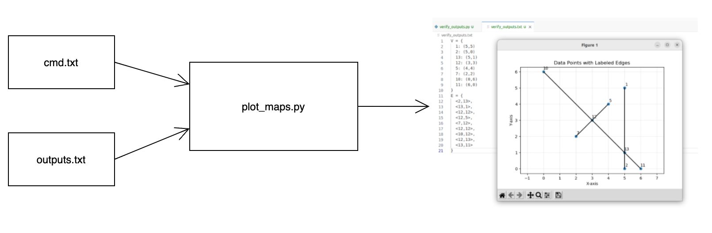
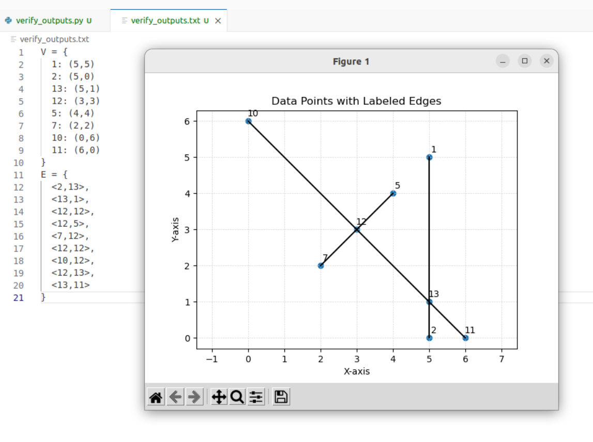

# How to plot the input and output map

It's simple! Just prepare two txt file and run plot_maps.py 

# Input:
1-cmd.txt : the streets add from 'add' cmds. this file can be empty
2-outputs.txt : the output graph from 'gg' cmd. this file can be empty

# The output is like:

