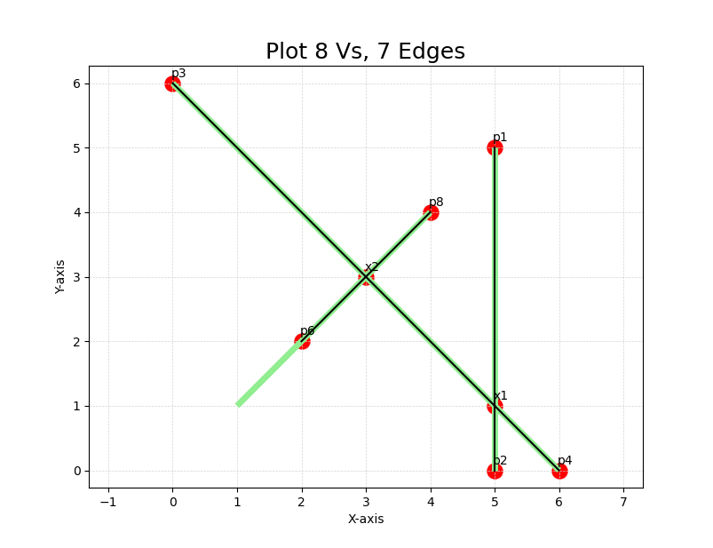

## [Map1] has 8 Vs and 7 Es

<span style="color: red;">This is NOT a normal case, since p7 is covered by x2, which should be regarded as 'overlapping'..</span>


use cmd:
```
add "rm street" (5,5) (5,0)
add "kk street" (0,6) (6,0)  
add "s street" (1,1) (2,2) (3,3) (4,4)
gg
```
the output should be like:
```
V = {
  p1: (5, 5),
  p2: (5, 0),
  x1: (5.00, 1.00),
  p3: (0, 6),
  p4: (6, 0),
  x2: (3.00, 3.00),
  p6: (2, 2),
  p8: (4, 4)
}
E = {
  <p2,x1>,
  <x1,p1>,
  <p3,x2>,
  <x2,x1>,
  <x1,p4>,
  <p6,x2>,
  <x2,p8>
}

```