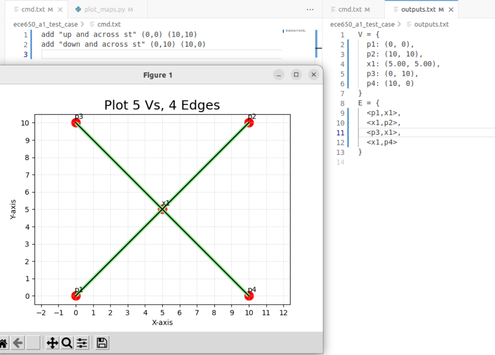
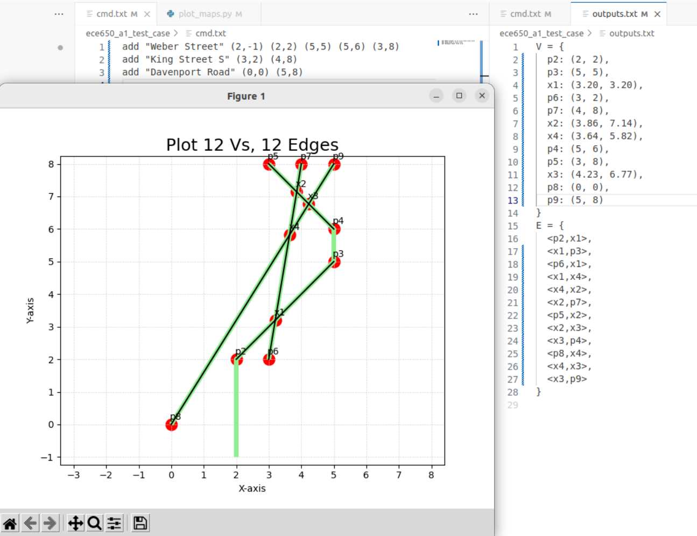
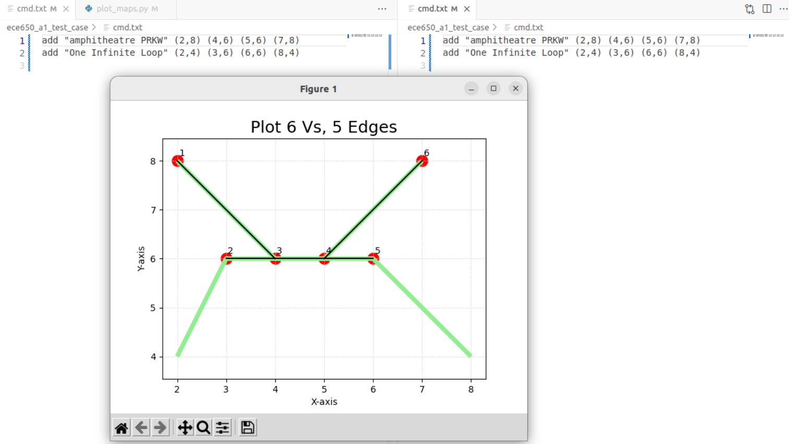

## [Map4] Normal Special cases
<span style="color: red;">These are 2 Normal and 1 Abnormal cases. 

The figures are drawn by plot_maps.py, which is in the upper dir.
</span>

## [1]


```
Input:
add "up and across st" (0,0) (10,10)
add "down and across st" (0,10) (10,0)
gg

Output:
----
V = {
  p1: (0, 0),
  p2: (10, 10),
  x1: (5.00, 5.00),
  p3: (0, 10),
  p4: (10, 0)
}
E = {
  <p1,x1>,
  <x1,p2>,
  <p3,x1>,
  <x1,p4>
}

----

Expected result:
----
V = { 
  0:  (0.00,0.00)
  1:  (10.00,10.00)
  2:  (0.00,10.00)
  3:  (10.00,0.00)
  4:  (5.00,5.00)
} 
E = { 
  <0,4>, 
  <1,4>, 
  <2,4>, 
  <3,4>
} 

```

## [2]

use cmd:
```
Input:
add "Weber Street" (2,-1) (2,2) (5,5) (5,6) (3,8)
add "King Street S" (3,2) (4,8)
add "Davenport Road" (0,0) (5,8)
gg

Output:
----
V = {
  p2: (2, 2),
  p3: (5, 5),
  x1: (3.20, 3.20),
  p6: (3, 2),
  p7: (4, 8),
  x2: (3.86, 7.14),
  x4: (3.64, 5.82),
  p4: (5, 6),
  p5: (3, 8),
  x3: (4.23, 6.77),
  p8: (0, 0),
  p9: (5, 8)
}
E = {
  <p2,x1>,
  <x1,p3>,
  <p6,x1>,
  <x1,x4>,
  <x4,x2>,
  <x2,p7>,
  <p5,x2>,
  <x2,x3>,
  <x3,p4>,
  <p8,x4>,
  <x4,x3>,
  <x3,p9>
}

----

Expected result:
----
V = {
  2:  (2.00,2.00)
  3:  (5.00,5.00)
  4:  (5.00,6.00)
  5:  (3.00,8.00)
  6:  (3.00,2.00)
  7:  (4.00,8.00)
  8:  (3.20,3.20)
  9:  (3.86,7.14)
  10:   (0.00,0.00)
  11:   (5.00,8.00)
  12:   (4.23,6.77)
  13:   (3.64,5.82)
}
E = {
  <2,8>,
  <5,9>,
  <6,8>,
  <8,3>,
  <8,13>,
  <9,7>,
  <9,12>,
  <10,13>,
  <12,4>,
  <12,11>,
  <13,9>,
  <13,12>
}


```

## [3]

use cmd:
```
Input:
add "amphitheatre PRKW" (2,8) (4,6) (5,6) (7,8)
add "One Infinite Loop" (2,4) (3,6) (6,6) (8,4)
gg

Output:
----
V = {
  p1: (2, 8),
  p2: (4, 6),
  p6: (3, 6),
  p7: (6, 6),
  x2: (5.00, 6.00),
  p4: (7, 8)
}
E = {
  <p1,p2>,
  <p6,p2>,
  <p2,x2>,
  <x2,p7>,
  <x2,p4>
}

----

Expected result:
----
V = {
 1: (2.00,8.00)
 2: (3.00,6.00)
 3: (4.00,6.00)
 4: (5.00,6.00)
 5: (6.00,6.00)
 6: (7.00,8.00)
}
E = {
 <1,3>,
 <2,3>,
 <3,4>,
 <4,5>,
 <4,6>
}


```