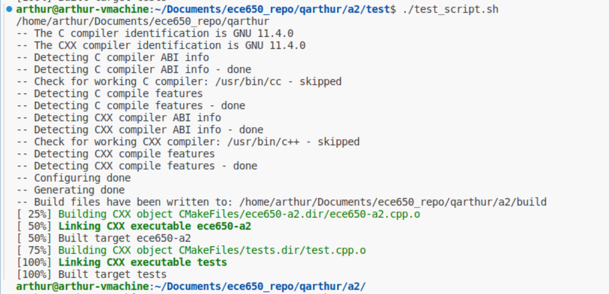

# Guide for testing a2 automaticlly

## 1.Introduction
All needed files are in `/test`, We use `test_script.sh` to test all the files automatically and log the input+out put gracely in file `test.log`.

## 2.How to use?
1. Make sure you `cd` to `/test` directory.
1. Compile your program `ece650-a2` first.
1.  <span style="color:red;">Run `chmod +x test_script.sh` to give this script execute permission. </span>
1. Run `./test_script.sh` and checkout `test.log`.
1. That's it!

## 3.Key notes in the code


Note1: Your executable is in `../build/` because we have defined `    ../build/ece650-a2 < $infile >> test.log
`, modify it if you have your executable in other place.

Note2: `../build/ece650-a2 < $infile >> test.log 2>&1`, here ***'2>&1'***, means to  redirect both standard output (stdout) and standard error (stderr) to the same file.


```
echo "" > test.log # Clear the log file first
counter=1

for infile in ../test/t*.in; do
    echo "---------------------" >> test.log
    echo "No.$counter, testing $(basename $infile)" >> test.log
    echo "input is:" >> test.log
    cat $infile >> test.log
    
    echo -e "\noutput is:\n" >> test.log
    ../build/ece650-a2 < $infile >> test.log 2>&1 #output cout and cerr both to the log file.
    echo -e "\n---------------------" >> test.log
    ((counter++))
done
```

## 4. Updates (Feb 16, 2024)

I add some command in top of the test_script.h file, so that **It can compile and run the test all automatically!**

```
cd ../
if [ -d build ]; then
  rm -r build
fi
cd ../
pwd
cd a2 && mkdir build && cd build && cmake ../
make
cd ../test

echo "" > test.log # Clear the log file first
```

### How to use it?
 1. Make sure you `cd` to  `/test` directory. 
 2. Run `./test_script.sh` and checkout `test.log`.

 