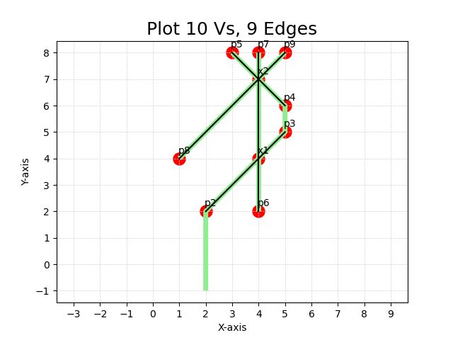
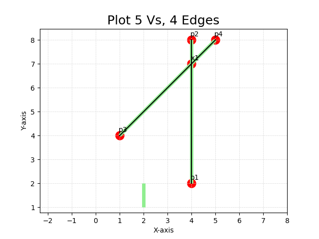
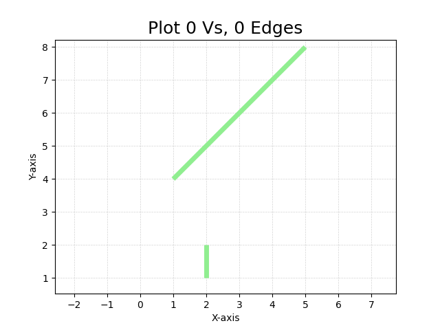

## [Map0] professor's


<span style="color: red;">This is a NORMAL case, which cotains 3 small examples.</span>

## [1/3]
use cmd:
```
add "Weber Street" (2,-1) (2,2) (5,5) (5,6) (3,8)
add "King Street S" (4,2) (4,8)
add "Davenport Road" (1,4) (5,8)
gg
```
the output should be like:
```
V = {
  p2: (2, 2),
  p3: (5, 5),
  x1: (4.00, 4.00),
  p6: (4, 2),
  p7: (4, 8),
  x2: (4.00, 7.00),
  p4: (5, 6),
  p5: (3, 8),
  p8: (1, 4),
  p9: (5, 8)
}
E = {
  <p2,x1>,
  <x1,p3>,
  <p6,x1>,
  <x1,x2>,
  <x2,p7>,
  <p5,x2>,
  <x2,p4>,
  <p8,x2>,
  <x2,p9>
}

```

## [2/3]


use cmd: (Note that the original command used 'mod', but to let it pass our verify_outputs.py, we just modify it, cause we're focusing on the algorithm not parsing commands.)
```
add "King Street S" (4,2) (4,8)
add "Davenport Road" (1,4) (5,8)
add "Weber Street" (2,1) (2,2)
gg
```
the output should be like:
```
V = {
  p1: (4, 2),
  p2: (4, 8),
  x1: (4.00, 7.00),
  p3: (1, 4),
  p4: (5, 8)
}
E = {
  <p1,x1>,
  <x1,p2>,
  <p3,x1>,
  <x1,p4>
}
```

## [3/3]


use cmd: (Note that the original command used 'mod', but to let it pass our verify_outputs.py, we just modify it, cause we're focusing on the algorithm not parsing commands.)
```
add "Davenport Road" (1,4) (5,8)
add "Weber Street" (2,1) (2,2)
gg
```
the output should be like:
```
V = {
}
E = {
}
```