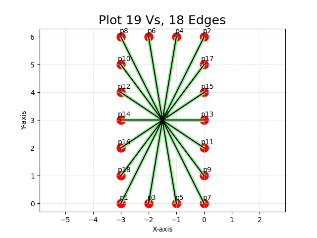
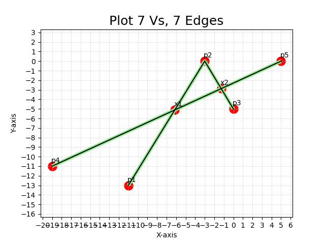

## [Map2] Normal Special cases
<span style="color: red;">This is a NORMAL case</span>

## [1]

use cmd:
```
add "Davenport Road" (-3,0) (0,6)
add "Weber Street" (-2,0) (-1,6)
add "KKK" (-1,0) (-2,6)
add "QQQ" (0,0) (-3,6)
add "PPP" (0,1) (-3,5)
add "MMM"  (0, 2) (-3, 4)
add "NNN" (0, 3) ( -3, 3)
add "RRR" (0,4) (-3, 2)
add "SSS" (0,5) (-3,1)
gg
```
the output should be like:
```
V = {
  p1: (-3, 0),
  p2: (0, 6),
  x1: (-1.50, 3.00),
  p3: (-2, 0),
  p4: (-1, 6),
  p5: (-1, 0),
  p6: (-2, 6),
  p7: (0, 0),
  p8: (-3, 6),
  p9: (0, 1),
  p10: (-3, 5),
  p11: (0, 2),
  p12: (-3, 4),
  p13: (0, 3),
  p14: (-3, 3),
  p15: (0, 4),
  p16: (-3, 2),
  p17: (0, 5),
  p18: (-3, 1)
}
E = {
  <p1,x1>,
  <x1,p2>,
  <p3,x1>,
  <x1,p4>,
  <p6,x1>,
  <x1,p5>,
  <p8,x1>,
  <x1,p7>,
  <p10,x1>,
  <x1,p9>,
  <p12,x1>,
  <x1,p11>,
  <p14,x1>,
  <x1,p13>,
  <p16,x1>,
  <x1,p15>,
  <p18,x1>,
  <x1,p17>
}


```

## [2]

use cmd:
```
add "Davenport Road" (-11,-13) (-3,0) (0,-5)
add "Weber Street" (-19, -11) (5,0)
gg
```
output:
```
V = {
  p1: (-11, -13),
  p2: (-3, 0),
  x1: (-6.14, -5.11),
  p4: (-19, -11),
  p5: (5, 0),
  x2: (-1.27, -2.88),
  p3: (0, -5)
}
E = {
  <p1,x1>,
  <x1,p2>,
  <p4,x1>,
  <x1,x2>,
  <x2,p5>,
  <p2,x2>,
  <x2,p3>
}

```